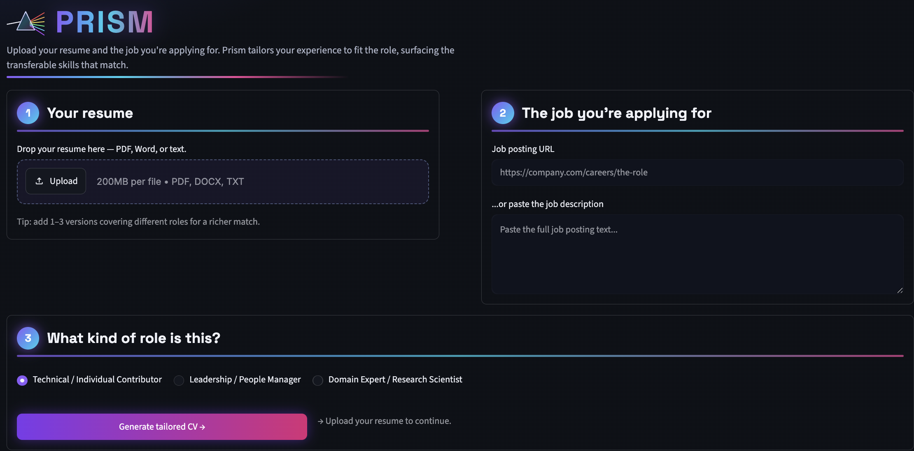

# Prism

**Tailor your resume to the job you're actually applying for.**

[](https://prism-resume.streamlit.app)
&nbsp;
[](LICENSE)

Give Prism your resume and a job posting. It reads the role, finds the experience of yours that fits, drops what doesn't, rewrites your bullets in the language the role uses, and surfaces the transferable skills that match — then hands you a tailored Word doc. Like light through a prism, one background is refocused for whatever role you're aiming at.

<br clear="left" />

## Demo

<!-- Save a screenshot of the app to assets/screenshot.png and it will show here -->


**Try it:** [prism-resume.streamlit.app](https://prism-resume.streamlit.app)

## The problem it solves

Most people send the same resume to every job, or hand-edit it for hours per application. Prism does the tailoring for you: you paste the job, it decides what of *your* experience is relevant to *this* role and how to phrase it.

The key distinction: **nothing is invented**. All content comes from your own experience. Prism selects, reorders, and rephrases to fit the job — but never fabricates skills or accomplishments you don't have.

## How it works

```
your resume  +  job description (URL or text)
         │
         ▼
Stage 1  Parse the job       → role, company, requirements, domain            (GPT-4o)
         │
         ▼
Stage 2  Score & select      → score every bullet 0–10 against the job         (GPT-4o-mini)
         │                     85% LLM judgment + 15% tag overlap
         │                     Human review: accept / drop roles / drop bullets
         ▼
Stage 3  Polish bullets      → rewrite selected bullets in the role's language (GPT-4o)
         │                     Cross-domain rule: swap jargon the job doesn't use
         │                     for the transferable concept it demonstrates
         │                     Human review: before/after diff, targeted edits
         ▼
Stage 4  Generate CV         → tailored professional summary + Word doc        (GPT-4o)
```

Model routing keeps cost low: the many bullet-scoring calls run on GPT-4o-mini, and only the JD parsing, rewriting, and summary use GPT-4o. A full tailored CV costs roughly **$0.05–0.15** in API usage.

## Role types

The same background produces materially different CVs depending on the role type you pick — it biases which experience scores highest:

| Role type | Best for |
|---|---|
| **Technical / IC** | ML Engineer, Data Scientist, Research Scientist, SWE |
| **Leadership / People Manager** | Principal DS, Team Lead, Manager, Director |
| **Domain Expert / Research Scientist** | Pharma, Biotech, Academic-adjacent, Clinical Research |

## Quick start

```bash
# Install uv
curl -Ls https://astral.sh/uv/install.sh | sh

# Clone and install
git clone https://github.com/shilpasy/prism
cd prism
uv sync

# Add your OpenAI key (copy the example and fill it in)
cp .env.example .env   # then edit .env

# Run
uv run streamlit run app.py
```

## How you give Prism your experience

Upload your resume (1–3 versions if you have them — different roles, different formats). Prism reads it into a structured record of everything you've done. This is *not* the product — it's just how Prism learns your background so it has the full picture to draw from when tailoring. Under the hood that record is a `master_resume.json`; you never have to touch it.

Prefer to build it by hand? Download `templates/master_resume_template.json` from the sidebar. See `examples/example_master_resume.json` for a realistic reference.

## Deploying (free)

Prism is stateless and docx-only, so it deploys free on **Streamlit Community Cloud** — no Docker, no Chrome. Set these in the host's Secrets panel (never commit them):

| Variable | Purpose |
|---|---|
| `PRISM_FREE_KEY` | Your OpenAI key, used to fund a capped free trial for visitors. |
| `PRISM_DAILY_FREE_LIMIT` | Global hard cap on free runs per day (default `10`, ~$1/day). |
| `PRISM_FREE_PER_SESSION` | Free runs per visitor before they need their own key (default `2`). |

`OPENAI_API_KEY` is **ignored on the server** — it only takes effect locally when `PRISM_ALLOW_ENV_KEY=1` is also set. This is deliberate: a stray `OPENAI_API_KEY` can never become an uncapped shared key in production.

## Architecture

```
resume_agent/
├── schema.py       Pydantic models: MasterResume, Experience, Bullet, Project, ...
├── pipeline.py     Four-stage LLM pipeline (parse → score → polish → summarise)
├── prompts.py      All LLM prompts — tuned for GPT-4o / GPT-4o-mini
├── cv_builder.py   Generates the tailored .docx (python-docx)
├── parser.py       Converts an uploaded PDF/DOCX resume → master_resume.json (GPT-4o)
└── selector.py     Tag-based fallback selector (no LLM)

app.py              Streamlit UI — multi-stage with human-in-the-loop review
.streamlit/         Prismatic dark theme
templates/          Annotated master_resume_template.json
examples/           Realistic anonymized example resume
```

**Stack:** Python · Streamlit · OpenAI (GPT-4o / GPT-4o-mini) · Pydantic · python-docx · pdfplumber

## Tagging

Each bullet has a `tags` list — keywords describing what type of work the bullet *demonstrates* (not what it literally says). The scorer uses these alongside LLM judgment to decide what fits each role.

```json
{
  "text": "Built XGBoost churn model reducing churn 18%, deployed via FastAPI.",
  "tags": ["ml", "python", "xgboost", "production", "cloud"]
}
```

Full tag vocabulary is in `templates/master_resume_template.json`.

## License

MIT © 2026 Shilpa Siddappa Yadahalli
